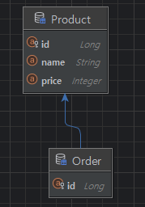
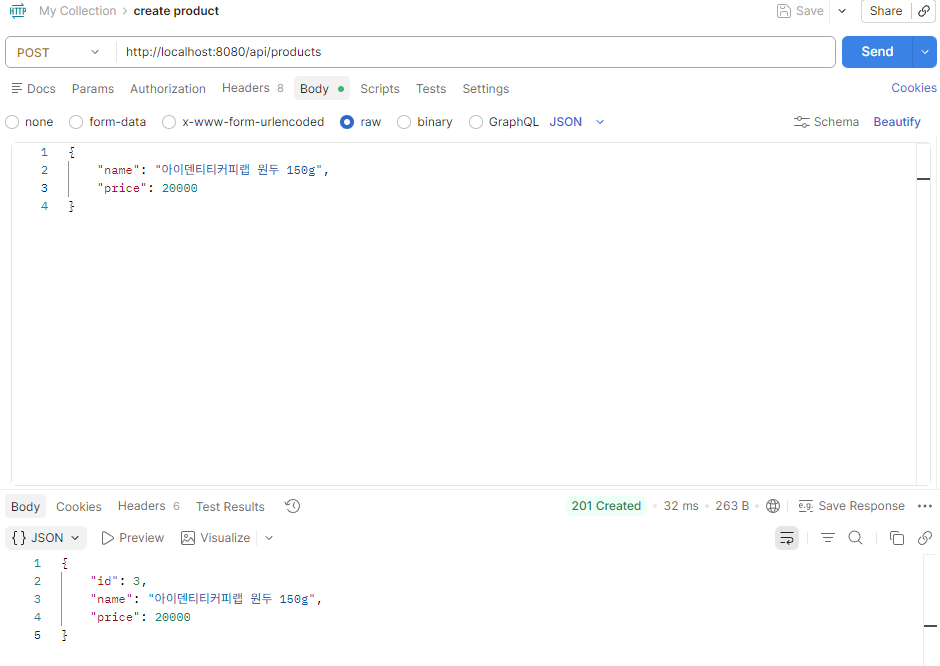
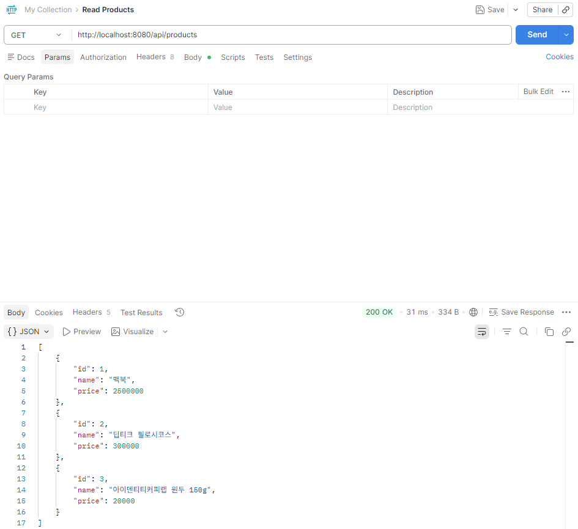
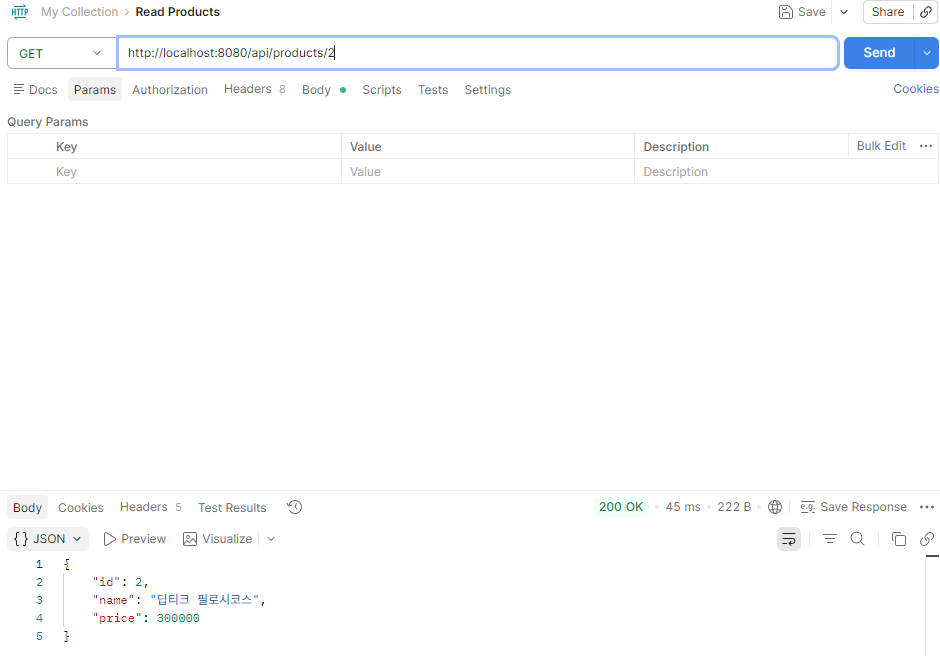
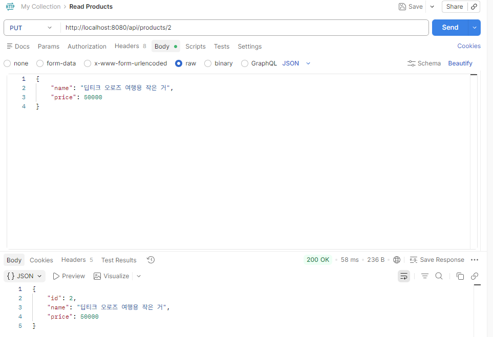
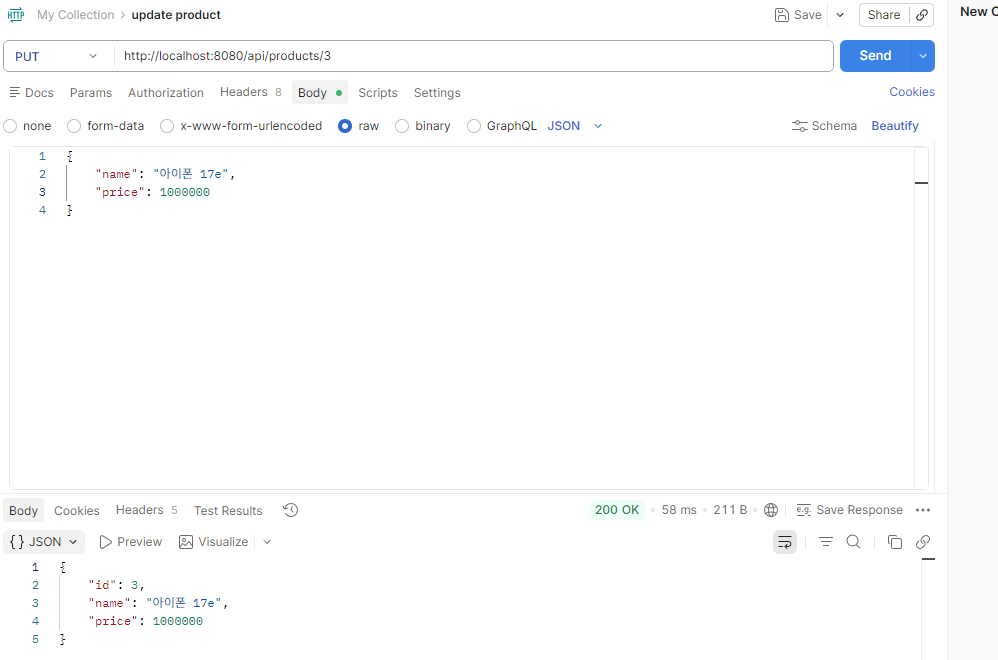
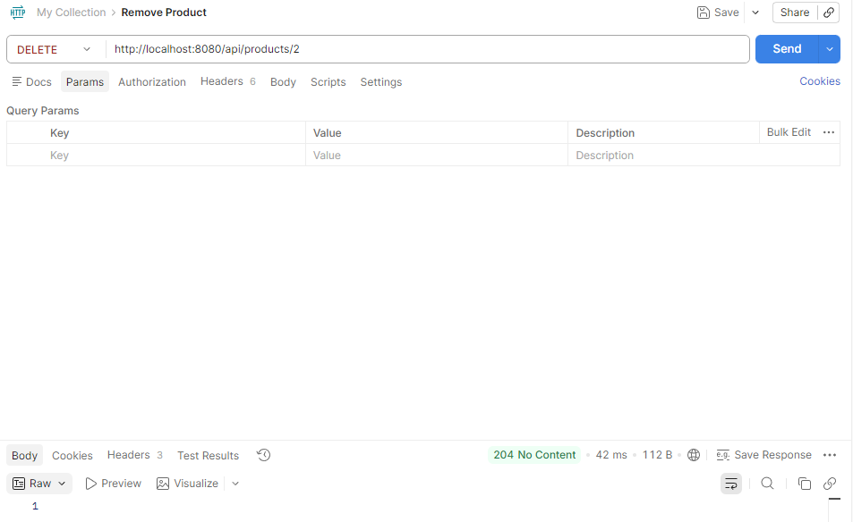

# Code Shadowing - The First

## Overview

> LLM Chatbot, Coding Assistant에 의존하지 않고 Spring Boot 코드를 쉐도잉하고, 추후에는 비즈니스 로직이 실려 있는 Controller를 받아 Service 계층으로 분리해용

1. 일정
- 1차: ~ 2026-04-15 (수) 18:00
- 2차: 피드백 ~ 2026-04-17 (금) 18:00
- 3차: 피드백 ~ 2026-04-20 (월) 18:00

2. 달리기반 체크리스트
- [x] 1차: 단순 따라치기
- [ ] 2차: Controller Layer에서 로직 분리 실습
  - [ ] Coding
  - [ ] Review
- [ ] 3차: Controller Layer에서 로직 분리 실습
    - [ ] Coding
    - [ ] Review

## Notes: 1차

### 생각해 볼 것
- 훑어 봤을 때, 프로젝트 생성 시 필요한 dependency: lombok, spring web, jpa
- api 테스트를 위한 설정:
  - supabase postgresql db 연동을 위한 드라이버 세팅 및 db info 환경변수화
  - postman 설치
- jpa 설정과 db info를 application 설정 파일(`applicaion.properties`)에 세팅

### API 테이블

| Method | Path | 설명 | 요청 본문 |
| --- | --- | --- | --- |
| `POST` | `/api/products` | 상품 생성 | `name`, `price` |
| `GET` | `/api/products/{id}` | 상품 단건 조회 | - |
| `GET` | `/api/products` | 상품 목록 조회 | - |
| `PUT` | `/api/products/{id}` | 상품 수정 | `name`, `price` |
| `DELETE` | `/api/products/{id}` | 상품 삭제 | - |

- Request Body: `name`(필수), `price`(필수, 0 이상)
- Response Body: `id`, `name`, `price`

### 실습 결과

### 삽질

- Service 계층에서 클래스에는 `@Transactional(readOnly = True)`를 걸더라도, 내부 메소드들에 개별적으로 걸어줘서 권한을 줄 수 있음. 실습중에 해당 부분을 누락해서 api 테스트에서 오류가 발생한 경험.
